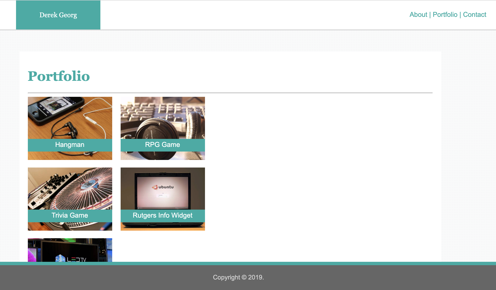
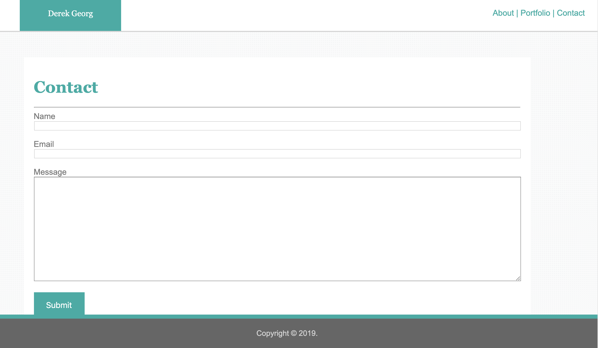

# Basic Portfolio

## Overview

##### Project Link: (https://derekgeorg.github.io/Basic-Portfolio/)

This project was our first assignment at the *UT Austin Coding Boot Camp*. 

Basic HTML and CSS coding was used to create this three page website.

Profile image, portfolio images and background images were stored within the project and relative paths used to link.

### Learned: 
floats, clear, position: fixed/relative/absolute, padding, git clone, add, commit, push

### All Pages are composed of:
* A Navbar with logo/name and links to About, Portfolio and Contact to navigate the website

* One main 960px content section

* A footer with top border and text

## ABOUT

## PORTFOLIO

Because this was our first assignment the projects listed on the *Portfolio* page don't link anywhere. Rather than updating this first Portfolio site with new projects I recreated the entire site later.

## CONTACT

Basic Contact form with Name, Email and Message fields. Submit button included at the bottom.

