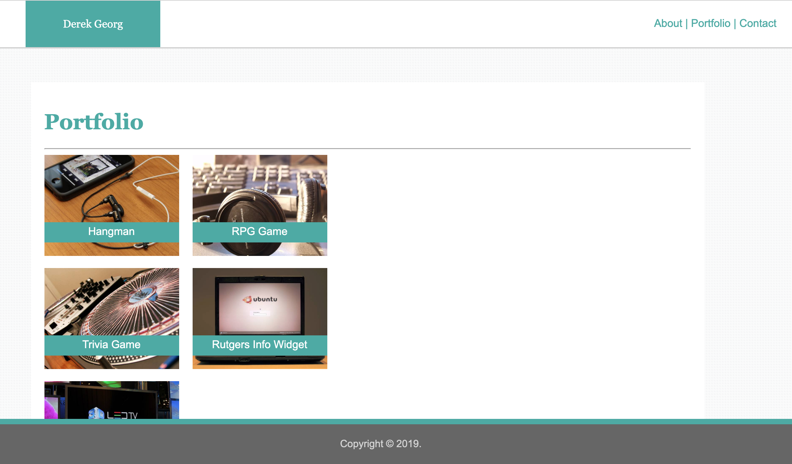

# My First Portfolio

###### Project Link: (https://derekgeorg.github.io/Basic-Portfolio/)

This project is my first portfolio assignment at the *UT Austin Coding Boot Camp*. 

Basic HTML and CSS coding was used to create this three page website.

